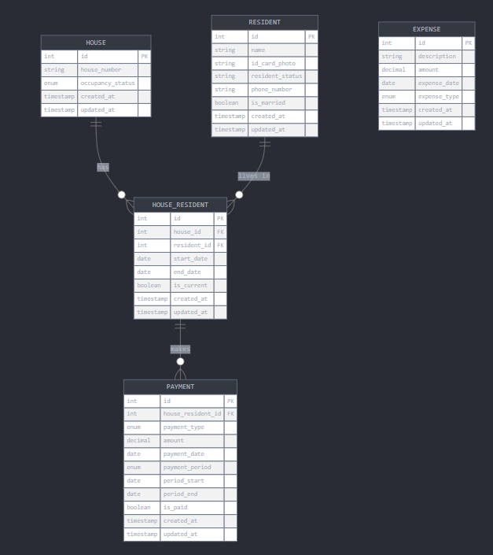
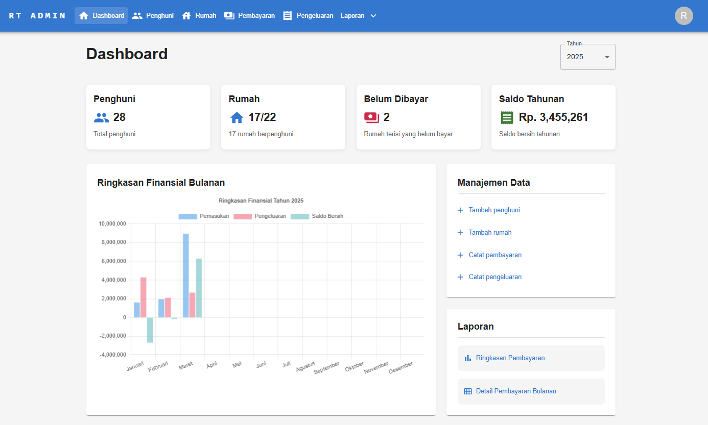
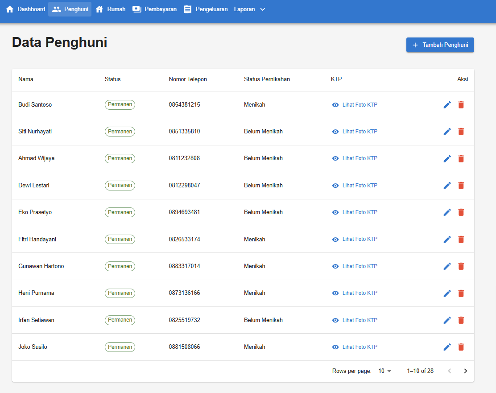
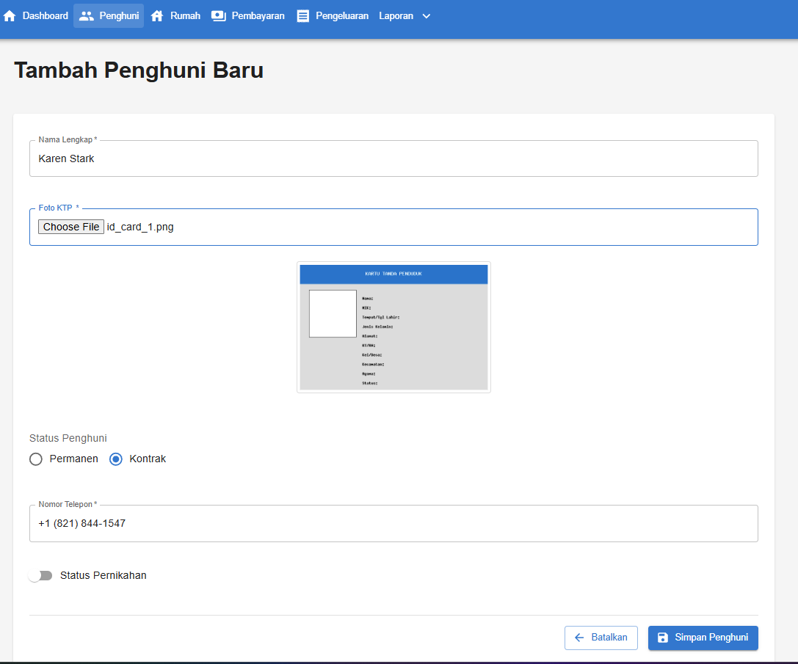
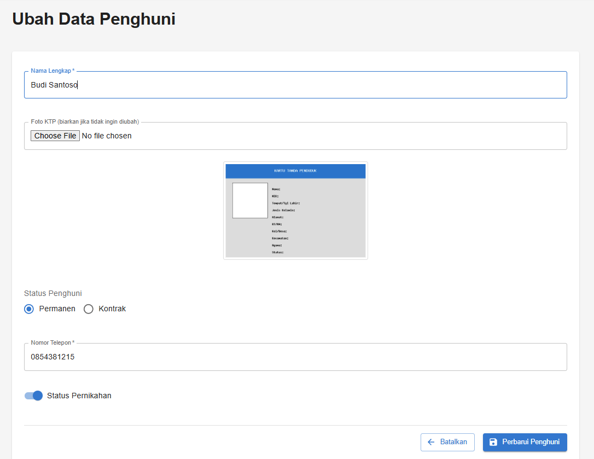

# Sistem Manajemen Perumahan

Aplikasi manajemen perumahan yang dirancang untuk membantu RT dalam mengelola administrasi perumahan, termasuk data penghuni, pembayaran iuran, dan pengeluaran.

## Repositori Terkait

Proyek ini terdiri dari dua repositori terpisah:

- [Backend Laravel](https://github.com/arifafandi/rt-management-system-backend) - API dan logika bisnis
- [Frontend React](https://github.com/arifafandi/rt-management-system-frontend) - Antarmuka pengguna

## Gambaran Umum

Aplikasi ini dibuat untuk membantu RT mengelola administrasi perumahan dengan 20 rumah (15 dihuni tetap dan 5 dihuni sementara/kontrak). Sistem mengelola:

- Data penghuni dan rumah
- Pembayaran iuran bulanan (satpam Rp100.000 dan kebersihan Rp15.000)
- Pengeluaran rutin dan non-rutin
- Laporan keuangan bulanan dan tahunan

## Entity Relationship Diagram

## Fitur Utama

### 1. Dashboard

Dashboard menampilkan ringkasan status perumahan dan keuangan:
- Jumlah rumah yang dihuni/tidak dihuni
- Status pembayaran bulan ini
- Grafik pemasukan dan pengeluaran
- Saldo tahunan

### 2. Pengelolaan Penghuni

Fitur untuk mengelola data penghuni:
- Daftar semua penghuni

- Form tambah penghuni baru

- Form edit data penghuni

- Lihat foto KTP

### 3. Pengelolaan Rumah

Fitur untuk mengelola data rumah dan penghuninya:
- Daftar semua rumah dengan status hunian

- Form tambah/edit rumah

- Detail rumah

- Riwayat penghuni

- Riwayat pembayaran setiap rumah

- Manajemen penghuni

### 4. Pengelolaan Pembayaran

Fitur untuk mencatat dan melacak pembayaran iuran:
- Daftar semua pembayaran

- Form tambah pembayaran baru

- Edit pembayaran

### 5. Pengelolaan Pengeluaran

Fitur untuk mencatat pengeluaran perumahan:
- Daftar semua pengeluaran

- Form tambah pengeluaran baru

- Form edit pengeluaran baru

### 6. Laporan Keuangan

Fitur untuk melihat laporan keuangan perumahan:
- Ringkasan keuangan bulanan dan tahunan

- Laporan bulanan pemasukan dan pengeluaran

## Teknologi yang Digunakan

### Backend:
- PHP 8.2.16
- Laravel 10
- MySQL

### Frontend:
- Node.js v22.14.0
- React dengan Vite
- Material UI

## Persyaratan Sistem

- PHP 8.2.16 atau lebih tinggi
- Node.js v22.14.0 atau lebih tinggi
- MySQL
- Composer
- NPM atau Yarn (rekomdasi npm)

## Langkah Pengembangan

Untuk mengembangkan aplikasi ini:

1. Clone repositori backend dan frontend
2. Ikuti petunjuk instalasi di masing-masing README
3. Backend akan berjalan di http://localhost:8000
4. Frontend akan berjalan di http://localhost:5173